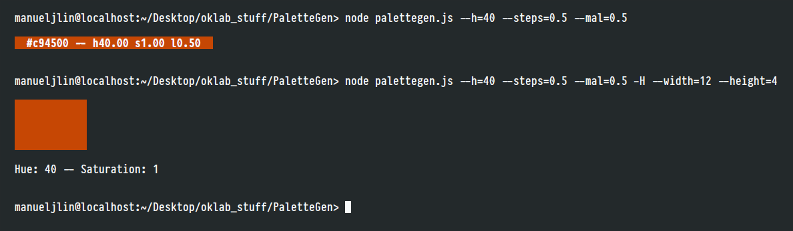

# PaletteGen
or *"Palette (not the ffmpeg thing) Gen"*

Simple palette generator using [Oklab](https://bottosson.github.io/posts/oklab/) (or [Okhsl](https://bottosson.github.io/posts/colorpicker/#okhsl), technically).
The code is probably ...not the best, but I guess it gets the job done.

 

## Dependencies
* [Node.js](https://nodejs.org/en/)
* NPM (Node's package manager, included in Node)
* [culori](https://github.com/Evercoder/culori) `npm install culori`
* [chalk](https://github.com/chalk/chalk) `npm install chalk`

## Arguments
The info at the right should be read like the Kotlin range operator: (minimumValue..maximumValue) : fallbackValue. If the number you inputted is outside of the valid value ranges, it will too use the 'fallbackValue'

* --h: Set the hue (0..360) : 0
* --s: Set the saturation (0..1) : 1
* --mil: Set the minimum lightness (0..1) : 0.05
* --mal: Set the maximum lightness (0..1) : 0.95

 

* --hshift: Change the hue by n in each subsequent color (-20..20) : 0
* --sshift: Change the saturation by n in each subsequent color (-1..1) : 0
* --steps: Change the lightness by n in each subsequent color, from maxLightness until minLightness (0.01, 1) : 0.05
    * Modifying this will result in smaller steps (more colors) or bigger steps (less colors) since it will reach minLightness earlier or later depending on it.

 

* -H: Hide text
    * --width: Set width of color swatch (2..12) : 4
    * --height: Set height of color swatch (1..4) : 2

 

A few example commands:

1. `node palettegen.js --h=80 --s=0.75 -H --width=12 --height=2` 
    Set the hue to 80, the saturation to 75%, hide the text and specify swatch width and height in characters (spaces) 
    

2. `node palettegen.js --h=170` 
    Set the hue to 170, and just use the default values (fallbackValue) for everything else 
    

3. `node palettegen.js --h=70 --mil=0.75` 
    Set the hue to 70 and the minimum lightness to 75%
    

4. `node palettegen.js --h=192 --hshift=4 -H --width=12 --height=2` 
    Set the hue to 192, then, for every new color, [hue shift](https://www.blue-canary.net/miniature-painting/painting-tips-and-guides/hue-shifting/) 4 steps
    

5. `node palettegen.js --h=192 --s=0 --sshift=0.05 --hshift=2` 
        Set the hue to 192, then, for every new color hue shift 2 steps, and increase saturation by 0.05
    

## Roadmap

### Easy stuff
* [x] ~~Support custom amount of lightness steps (currently hardcoded to increments of 0.05)~~
* [ ] Single color syntax: `node palettegen --ok(192, 1, 0.5)`
    * Currently possible but could be better: `node palettegen.js --h=40 --steps=0.5 --mal=0.5` 
      
* [ ] Custom type of output: `node palettegen --h=236 --o=rgb | --o=hsl` etc

### The harder stuff
* [ ] Generate images with the palettes directly on them somehow
* [ ] Check WCAG contrast and readjust the lightness on the fly to meet the required inputted contrast level (good luck with that future me)
* [ ] Presets for h, s, l or any combination, like UI, digital painting etc
* [ ] Option to generate complementary colors (specified in amount) <!-- not _that_ hard tho -->

## License...?
I was going to initially set it as MIT, seeing as both culori and chalk use it, but it's not really right if there's a giant section of code [copied from StackOverflow](https://stackoverflow.com/a/54098693/17629516)... lol. It's not like licenses matters that much for a small js file anyways, sooo
