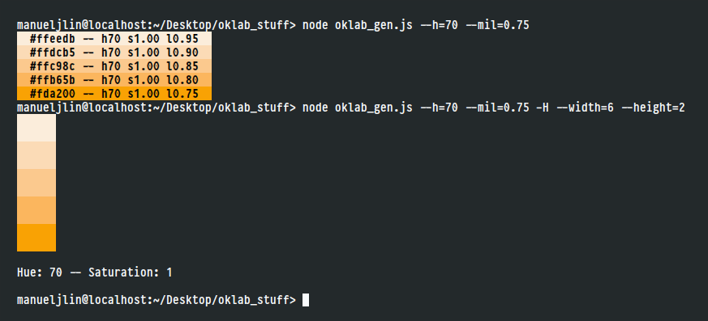

# PaletteGen
Simple palette generator using [Oklab](https://bottosson.github.io/posts/oklab/) (or [Okhsl](https://bottosson.github.io/posts/colorpicker/#okhsl), technically).
The code is probably ...not the best, but I guess it gets the job done.

 

## Dependencies
* [Node.js](https://nodejs.org/en/)
* NPM (Node's package manager, included in Node)
* [culori](https://github.com/Evercoder/culori) `npm install culori`
* [chalk]() `npm install chalk`

## Arguments
* --h: Set the hue (0..360) : 0
* --s: Set the saturation (0..1) : 1

* --mil: Set the minimum lightness
* --mal: Set the maximum lightness

* -H: Hide text
    * --width: Set width of color swatch (2..12) : 4

A few example commands:

1. `node palettegen.js --h=80 --s=0.75 -H --width=12 --height=2` 
    

2. `node palettegen.js --h=170` 
    

3. `node palettegen.js --h=70 --mil=0.75`
    

### Roadmap...?
* Support custom amount of lightness steps (currently hardcoded to increments of 0.05)
* Generate images with the palettes directly on em, somehow?